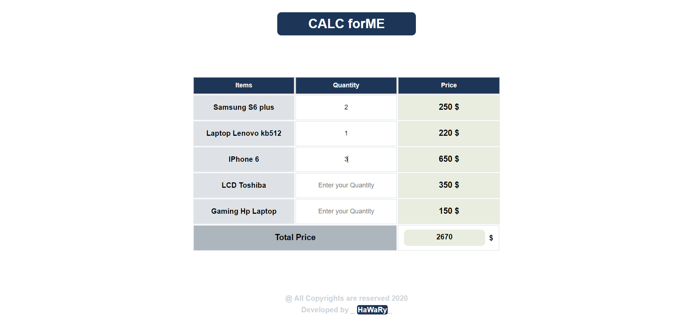

# Calc For Me

  

Calc For Me is a small calculator application that calculates the total price depending on the quantity of the products. 

  
  

## Demo & How to interact  

- Just enter the Quantity of each Product and the Total Price will be shown below.  

## Getting Started

You can try the APP from [here](https://mohamed-elhawary.github.io/calc-for-me/)

## Prerequisites

Just Modern Browser like "Chrome" and a Code Editor for Deployment and Develop.

## Built With

* HTML5
* CSS3
* JS  

## Libraries  

* [jQuery](https://jquery.com/)  

## Author

* Mohamed Elhawary  

## Contact Me  

* Email: mohamed.k.elhawary@gmail.com

## Deploy with Me

Feel Free to Deploy it with me, send Issues or a Pull Request and i'll deal with you, just test it First.

## License

Licensed under the [MIT License](LICENSE)

